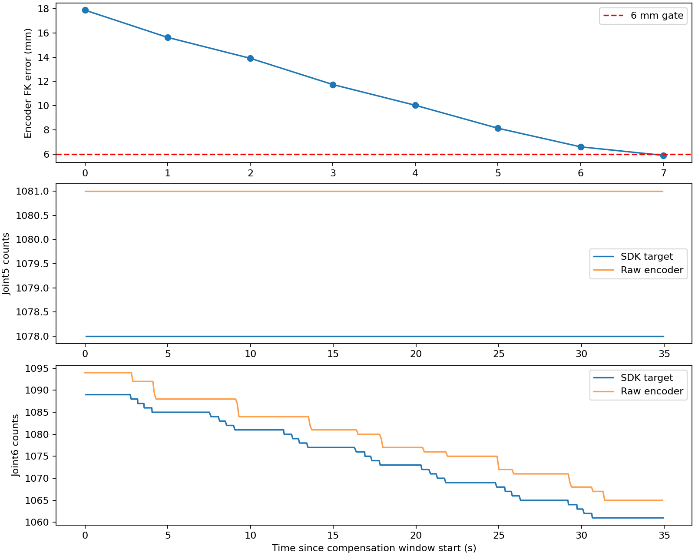

# 2026.9.20 预抓取剩余额度搜索与实机验证

用户授权继续解决八步补偿后7.303 mm残差，并明确禁止停止使能。本文记录后续修改与新实验，不覆盖此前失败结论。原始RGB-D、现场视频、bag及点云回放pickle仅保留本机；公开记录限于用户已授权的派生数字、关节图与校验清单。

用户已在第七轮结束后关闭全部硬件和WSL，并明确要求继续离线处理。下文节点PID、加载状态和使能反馈均为当时的历史记录，不表示当前节点仍在线。本阶段不启动ROS、WSL或硬件，不发布运动或去使能命令。七轮均未闭爪或提起，完整抓取尚未成功。

## 原因与修改

上一轮从18.784804 mm开始，局部搜索首步命令 `[4,0,4,4,0,-4]`，J6实测不动后保持；随后J1弱响应也保持，J3在+32 count上限终止。只剩J3/J4时，即使假设继续单位响应，整数终点最小残差仍约7.237 mm。

离线发现四轴配合有另一方向：以相同真实起点、相同固定视觉目标，假设被命令轴按增量响应，J6向正方向配合可在原额度内收敛。旧算法只优化下一步，不能利用剩余总额度选择配合方向；这是一项搜索限制，不证明改变J6方向就必有物理响应。

新版用最多八轮有限坐标搜索，在原始起点±32 count及剩余步数允许范围内寻找条件终点，再选取向该终点前进的单步。每次新实测响应后重算；预测增益仍由实际响应更新。保持J2/J5及后续弱响应轴，保持6 mm/5°、每步4 count、12步/60秒、0.035 rad跟随差、2 count最小响应及所有完整路径/接续段检查。没有重置旧plan/epoch额度，没有改固件、控制增益、标定或去使能路径。

日志新增 `conditional_budget_guide`，明确它不是全局最优证明、路径许可或物理收敛证据。算法不会将指南终点一次下发；每步仍单独验证和执行。

## 离线验证

- 上轮真实起点+明确的单位响应假设：8步，18.784804→5.533682 mm。初步 `[4,0,4,4,0,4]`，原视觉目标保持。
- J3每4 count只响应3 count的假设：12步后6.349211 mm，仍按预算失败；全部轴无响应：第一步失败。没有为了回放成功修改阈值。
- 两个假设的共20条合成3秒轨迹通过原路径条件检查；不是MoveIt实机轨迹或执行许可。
- 历史八步实测回归显式重放历史命令与原反馈，仍保持7.303 mm失败；不能将历史测量归给新版不同命令。
- 受影响回归383项已通过：合跑382项通过，1项因旧测试固定要求6步而失败；该例按新搜索7步更新两个步数断言后，单独复测1项通过（9.60秒）。合跑73.04秒、7条既有弃用警告。没有将分次验证称为一次全量通过。覆盖补偿、网关、任务、预算重复调用、停止包络及轨迹执行。

## 控制权与实机记录

首次读取直控为true，机械臂已换姿态。用户回复“已经关闭直控”后重新读取false；使能true、保护未锁定。仅在交权后准备验证，未覆盖手动控制。

本机实验目录：`/home/zhuyupei/alicia_wa_full/.ros_log/grasp_budget_guide_20260920/`。保存重载前后快照、源码哈希、节点PID、运行日志、精确时间戳RGB-D关键帧、SDK/accepted反馈、原始帧诊断及完整阶段证据。录包新增被动记录`/demonstration`和`/alicia_d/protection_latched`；驱动中`/demonstration=true`会去使能，此实验不发布该命令。

网关已由PID196624重载为241680；task203332、remote184698、driver7197、硬件接口7198保持。重载前后已采样参数与七轴位置一致。第一次部署脚本只读PID查询接口不匹配，在任何信号前抛错；修正查询后重载成功。

### 第一次实机：观察运动成功，支撑面法向一致性拒绝

新远场计划`bf81d2d46987e41109604a2b`，14.761892秒观察轨迹实际执行并返回成功，实测观察CAD净空54.311 mm。近场随后因`FINAL_REFINE_3D_INVALID: support normal changed 4.5582deg (limit 4.0000deg)`终止。

没有接触预抓取、补偿、接近、闭爪或提起；补偿步数不适用，不是0 mm误差。保留118组同戳关键帧和完整反馈。记录内使能反馈均true、保护锁定均false，未观察到`/demonstration`输入；没有发送去使能。

[完整阶段结果](evidence/2026-09-20/pregrasp_budget_guide_first_result.json)、[使能输入与反馈摘要](evidence/2026-09-20/pregrasp_budget_guide_first_flags.json)、[本机文件校验](evidence/2026-09-20/pregrasp_budget_guide_first_manifest.json)。

### 第二次实机：从已到达的观察位采集新计划

第一轮未执行补偿；保留失败记录后，从当前清晰观察位采集独立新视觉计划。目录`.ros_log/grasp_budget_guide_clear_view_20260920/`。未放宽4°或改变第一轮测量/基准；未重载节点、重置补偿额度或改变门限。实机远场`07ef190a3bc8851844990352`复用当前观察位。近场两次请求过期后按原deadline采集新帧，最终在期限内绑定`5f8b2683cfed0fc7f4899f2a`。随后136.301476秒接触预抓取轨迹和7条3秒补偿轨迹均实际完成。

| 补偿步数 | 编码器FK残差(mm) |
| --- | ---: |
| 0 | 17.874107 |
| 1 | 15.628203 |
| 2 | 13.906536 |
| 3 | 11.742527 |
| 4 | 10.029254 |
| 5 | 8.137852 |
| 6 | 6.605696 |
| 7 | 5.903179 |

最终姿态误差3.633592°，通过原6 mm/5°，位置误差下降66.97%。SDK相对起点变化`[-10,0,+28,-26,0,-28]`；J3尚未到+32上限。第4步J1命令+2但实际0后保持，其他轴有界响应且误差持续下降。最终SDK`[741,1514,3157,1772,1078,1061]`，实测`[744,1497,3141,1776,1081,1065]`。

约34.9秒窗口内350条原始回包与350条accepted计数序列一致；J5始终1081，SDK目标始终1078。此窗口未复现腕部振荡，不是固件稳定性或绝对精度证明。

到位后进入最终视觉复核，20秒后`FINAL_REFINE_TIMEOUT`，未接近、闭爪或提起，完整抓取仍失败。所有8638条使能反馈true，未记录到去使能输入。

[完整结果](evidence/2026-09-20/pregrasp_budget_guide_actual_result.json)、[原始反馈分析](evidence/2026-09-20/pregrasp_budget_guide_actual_analysis.json)。新增真实七步fixture固定目标、URDF、冻结计划及实际命令/响应，不使用假设反馈冒充实机。

用户补充226.4秒现场视频，说明第二阶段补偿后姿态和精度不错、没有最终抓取。已抽查后段画面，夹爪保持张开；视频未提供与ROS严格对时或毫米尺度，数值仍来自原始编码器FK。[本机视频校验](evidence/2026-09-20/pregrasp_budget_guide_operator_video.json)，原视频及截图不上传。

## 最终视觉参考交接修复（实机曾加载，最终交接尚未验收）

最终阶段phase4在1789899312.678638696开始，却绑定源帧1789899310.764454603，早于最后补偿动作完成（1789899311.986628）。该帧RGB、depth、mask、object在录包中完整同戳，录入时间1789899311.777266。remote随后报告`Reached-view RGB-D unavailable`，未建立参考融合表面；最终候选全部缺少双侧实测支撑，报`NEAR_FIELD_NO_HARD_SAFE_CANDIDATE`。因此不能把此次失败归为夹爪闭合失灵，也不能仅放宽几何门。

任务端改为等待到位之后采集、最近收到且同目标的新观测，再用该精确帧建立phase。重复源帧不刷新接收时间，并绑定接收时间对应的源戳。等待、phase交接和推理共用原20秒绝对期限；没有新观测时直接报`FINAL_REFINE_REFERENCE_UNAVAILABLE`，不启动无参考的推理。remote仍核对原exact RGB-D组件、延迟、掩码和几何条件。初版等待采用接收后0.2秒、源年龄1.2秒的上限（后文记录其与现场配置不一致的修正）；不能保证CPU/传输延迟后remote必然接纳。

用户曾说明要先移动机械臂，期间只做离线修复，没有启动新动作。用户随后补充视频并要求继续解决全部问题；只读复核直控false、使能true、保护false。新交接逻辑通过239项任务/交接回归；补偿、RGB-D与remote推理相关529项回归一次通过（117.68秒）。随后仅task由PID203332重载为271814，gateway241680、remote184698、driver7197、硬件接口7198保持，未改参数。

用户随后要求暂停，尚未启动新抓取；用户再次要求继续后，重新检查：相隔1544秒，SDK目标、参考epoch和参数一致，J2实测+1 count，其余轴及夹爪不变。严格逐值比较因此停止启动，差异已明确记录；从当前实测状态继续新的视觉任务，不把两次反馈写为完全相同。新目录 `.ros_log/grasp_fresh_reference_20260920/` 保存部署和恢复核验。

[条件回放及逐步路径检查](evidence/2026-09-20/pregrasp_budget_guide_replay.json)。

### 第三次实机：交接修复已加载，观察后的法向检查先失败

目录 `.ros_log/grasp_fresh_reference_20260920/`。重试一次启动审批超时后正常启动，新远场 `0a9ba8832c73cda9f350c675` 通过精确审计与执行绑定，16.309767秒观察轨迹成功，实测CAD支撑净距74.425196mm。近场预览有有效3D证据，但与原远场支撑面法向变化6.5841°超过4°，任务FAILED/inactive。未执行接触预抓取、补偿、接近、闭爪或提起；没有进入最终视觉交接分支，不能将本轮称为该修复实机通过。

81组同戳RGB-D关键帧已封包，使能3851条全true，保护1692条全false，无去使能输入。未重置补偿额度；此轮未调用补偿。后续冻结原始源窗口和TF的几何复算结果见下文，支撑法向门限未修改。

[阶段结果](evidence/2026-09-20/pregrasp_fresh_reference_first_result.json)、[使能/保护证据](evidence/2026-09-20/pregrasp_fresh_reference_first_flags.json)、[暂停后恢复检查](evidence/2026-09-20/pregrasp_fresh_reference_reload_verification.json)。

冻结源窗口离线复算精确重现6.5841107°；原0.30扩展比下，到位参考→近场仅1.757265°、局部平面间距0.919mm，注册通过；远场→近场间距4.530mm、法向门失败。预先固定的采样范围敏感性实验0.15/0.60/1.00分别产生10.398790/1.958825/1.112298°，但后两项完整配准仍报YAW_BOUND_EXCEEDED。说明采样区域显著影响法向，不能直接改扩大系数、取过门结果或认定标定恢复。生产配置保持0.30。

[完整离线平面与配准结果](evidence/2026-09-20/pregrasp_fresh_reference_support_replay.json)。从当前清晰观察位启动独立新视觉任务以继续验证最终交接，目录 `.ros_log/grasp_fresh_reference_clear_view_20260920/`；不复用失败计划，不将新任务当成已修复跨姿态误差，节点和原有门限保持。

### 第四次实机：当前观察位复用，近场准备超时

远场`ab7a37eb0a37413ade7cd6da`复用已到达的观察位，未发布新的关节轨迹。近场90秒内两个请求RESULT_EXPIRED后重采，最后仍NEAR_FIELD_DIRECT_TIMEOUT；没有进入接触预抓取、补偿或最终视觉交接。79组关键帧已封包，所有使能反馈true、保护false，无去使能输入。[阶段结果](evidence/2026-09-20/pregrasp_fresh_reference_clear_view_result.json)。

过期请求253/254的本机候选生成耗时10.861/11.779秒，整段准备13.443/14.374秒，最终源年龄15.835/17.432秒。代码复核确认过期来自ROS协调器的整段准备/推理完成门；失败指标中的WSL耗时0是未接纳结果时不信任该指标，不能推断WSL未计算或WSL端拒绝。仅将WSL请求提前不能消除总耗时，因此未实施此项顺序调整。

去掉整块目标检测bbox内的背景拟合点，原采样范围下仍有6.465730°差异；该离线反例不支持“只清除物体边缘即可修复”。[排除bbox实验](evidence/2026-09-20/pregrasp_fresh_reference_support_exclusion.json)，没有修改生产ROI。

## 候选计算复用（第五轮接受，第七轮仍超时）

优化同一请求中的重复计算：倾角有序集合与先前探测完全一致时复用已计算的CAD候选；有新连续边界仍按原完整并集重新生成，保留编号和来源。候选接触证据复用本次已捕获的同戳已配准表面，避免每个候选重新逆变换整片点云；缓存不跨函数调用，后续请求/发布仍受原ticket与generation检查。所有到位、几何、图像年龄和阶段期限保持。

使用本轮冻结RGB-D几何、原始实测到位误差参数，在同进程交替执行原/新实现，32个候选的全部字段、变换、编号与审计逐项一致。耗时原2.521/2.863秒，新1.977/4.816秒，系统负载变化明显，不能从该组结果宣称固定加速比例或解决了实机期限问题。另一零到位误差条件的分析中，CAD生成调用24→12、表面逆变换217→1。586项remote/表面坐标回归一次通过（91.86秒）；新增跨调用失效测试单独1项通过（14.60秒）。[完整对比](evidence/2026-09-20/pregrasp_tabletop_reuse_comparison.json)。

加载前复核`/gui/joint_direct_mode=true`，脚本在第一个只读检查处终止，未发任何进程信号或控制命令；remote仍为PID184698，候选复用优化尚未加载。已请求操作者在GUI结束手动操作并保持使能后交回控制。目录 `.ros_log/grasp_tabletop_reuse_20260920/` 保留未加载脚本和状态快照。

操作者回复“已经关闭直控，可以继续”后复核通过，仅remote184698→318261加载复用优化；task271814/gateway241680/driver7197/硬件接口7198均保持，读取的抓取/机器人/驱动/控制器配置无变化。第五轮从用户新摆放姿态采集独立计划，目录 `.ros_log/grasp_tabletop_reuse_20260920/`，该轮已结束，结果如下。

### 第五次实机：近场已接受，补偿入口反馈证据拒绝

远场`d65a8fe3ac4b6cfcdc0c6af2`执行17.668854秒观察成功；近场`7791381cc9385e5eeb36ff9e`通过，候选生成1.063169秒，未发生准备阶段RESULT_EXPIRED，随后55.850649秒接触预抓取成功。到位后补偿尚未发出第一步，入口报`ENDPOINT_CORRECTION_FEEDBACK_UNAVAILABLE: missing, stale or future sdk_transmitted evidence`，任务FAILED/inactive，未闭爪或提起。117组关键帧已封包，使能5421条全true，保护2193条全false，未观察到去使能输入。[反馈与控制标志](evidence/2026-09-20/pregrasp_tabletop_reuse_flags.json)。

失败时附近SDK成功发送仍约10Hz，原始回包与accepted逐条一致，因此不支持驱动断流解释。按失败时刻1789904374.09重放最近128条各源，原停稳/新鲜度检查通过，局部SDK跟随FK差17.641670mm（不是对视觉目标的误差）。这只能证明录包订阅端有有效数据，不能冒充网关内部缓存当时的内容。采样复制两组历史本机复测中位54ms/最大73ms，检查中位45ms/最大95ms，也尚不能证明复制开销是唯一根因。

网关修改采样方式：消息在回调入库时已深复制且之后只读，采样在锁内只冻结引用元组，避免重复复制整段历史阻塞回调。保留0.5秒新鲜度、0.3秒停稳、两秒等待及源/epoch校验；失败报告增加实际采样时刻、各源最新源戳、数量和采集耗时，以定位缓存滞后，不延长时限。[第五轮阶段结果](evidence/2026-09-20/pregrasp_tabletop_reuse_live_result.json)、[失败时刻回放与复制耗时](evidence/2026-09-20/pregrasp_feedback_sampling_replay.json)。新采样相关7文件回归193项通过，另1项最初因测试浮点源戳构造相差1ns失败，改用整数秒/纳秒后单独通过（1.02秒）；共194项分次通过。新采样逻辑已于再次交权后加载，待实机验收。

第四轮附近曾同时运行本机离线几何回放，资源竞争可能影响耗时；不能把其两次过期完全归因于重复候选计算。第五轮运动期间仅做轻量日志监控，没有并行跑几何回放或测试。

### 反馈采样修复部署准备

第六轮目录 `.ros_log/grasp_feedback_snapshot_20260920/` 已准备。第一次重载前，直控锁存主题及参数均为true，唯一发布者为GUI自身 `/alicia_supervisor_gui`；任务FAILED/inactive、使能true、保护false。脚本在任何进程信号前退出，网关修复当时没有加载，也未启动第六次动作。操作者随后明确确认已取消直控并切到自动模式，重新进行现场核验。

再次核验通过，仅网关241680→338668加载采样修改；task271814、remote318261、driver7197、硬件接口7198保持。抓取、推理、机器人、驱动及控制器所列参数比较一致，使能true、保护false、直控false。随后采集独立新视觉任务，第六轮结果如下。

### 第六次实机：观察成功，近场支撑面间距拒绝

新远场a9af0e37d13545c9870597c6执行15.761800秒观察成功，近场跨视角支撑面局部间距5.099mm超过4mm，任务FAILED/inactive。未进入接触预抓取、补偿、最终视觉复核、闭爪或提起，因此尚不能验收网关反馈采样修复。77组关键帧封包，使能3884条全true、保护1668条全false、无去使能输入。复核源码已按共同目标中心比较平面间距，并非直接比较基座原点处的平面系数；本轮没有改几何门。

[第六轮结果](evidence/2026-09-20/pregrasp_feedback_snapshot_result.json)、[控制标志](evidence/2026-09-20/pregrasp_feedback_snapshot_flags.json)。

### 最终交接的现场延迟配置修正

后续检查发现新交接等待错误固定使用1.2秒源年龄，而现场remote的原有 `planning_snapshot_max_inference_latency_sec` 为5.0秒。第六轮录包中77个有效目标源帧到订阅端接收的延迟最小0.784秒、中位2.139秒、95分位3.496秒、最大3.751秒；仅9帧不超过1.2秒。这是录包端到达证据，不是task内部缓存；该差异证明固定默认值与现场已部署契约不一致，不能称此次尚未进入的最终复核已经失败。

任务端改为读取同一remote延迟配置，默认仍1.2秒，无效或非正有限数配置拒绝。到位后采集、最近接收0.2秒、精确源戳和目标身份绑定保持；remote仍执行原0.35秒完成年龄、5秒推理延迟、完整RGB-D及几何检查，所有等待仍共用20秒。新增覆盖配置延迟的新帧、早于到位的同帧及无效配置；266项任务/控制权回归一次通过（11.35秒，7条已有弃用警告）。仅task271814→348477加载修复，gateway338668/remote318261/driver7197/硬件7198保持，检查参数无变化；第七轮从当前已到达观察位获取独立新计划继续最终交接验证；跨姿态几何误差仍列为未解决项。

[原始源时序派生记录](evidence/2026-09-20/pregrasp_reference_timing.json)。

### 第七次实机：复用观察位，近场准备仍有超时

目录 `.ros_log/grasp_reference_latency_20260920/`；新远场cb5a9dc820b1c1fbc636f2c1复用已到达观察位，未发布新的关节轨迹。近场请求89准备中的候选生成14.192793秒、几何3.256675秒，源年龄21.568510秒而RESULT_EXPIRED；下一请求90跨过阶段期限后GENERATION_STALE。任务按原90秒截止NEAR_FIELD_DIRECT_TIMEOUT，未进入接触预抓取、补偿、最终视觉复核、闭爪或提起。86组关键帧已封包，使能3723条全true、保护1875条全false，无去使能输入。此轮未并行运行离线测试/几何回放。

[第七轮阶段结果](evidence/2026-09-20/pregrasp_reference_latency_result.json)、[控制标志](evidence/2026-09-20/pregrasp_reference_latency_flags.json)。优化后的候选生成仍有明显慢路径，不能将第五轮的单次1.063秒作为性能保证。请求89失败指标未保留完整源窗口，后续条件性能回放必须注明数据来源，不能冒称精确重现该请求。

## 用户关机后转入离线处理

用户先暂停实机，随后明确说明“已经关闭了所有的硬件和WSL”，授权继续离线处理。实机记录最后停在第七轮FAILED/inactive；本阶段仅处理已有源码、回归和本机冻结证据，不将用户关机后的状态写作机械臂保持使能。上述七轮记录内均未观察到去使能输入。

| 问题或修改 | 已有证据与尚缺验收 |
| --- | --- |
| 剩余额度引导补偿 | 第二轮实测7步达到5.903179mm、3.633592°；只证明该固定目标下的编码器FK到位，不证明外部绝对精度或持物成功。 |
| 反馈历史短锁采样与诊断 | 第六轮前曾加载；第六、七轮均未到补偿入口，尚无实机入口验收，也未确定第五轮拒绝的唯一根因。 |
| 到位后新帧交接及延迟配置对齐 | 分别于第三、七轮前曾加载；后续任务均被更早阶段拒绝，尚未验证最终视觉复核、接近、闭爪和提起。 |
| 候选生成时延 | 第五轮近场接受，第七轮仍准备过期；保留15秒结果时效及90秒近场期限，单次较快结果不构成性能保证。 |
| 跨姿态几何一致性 | 已见4°法向门、4mm支撑面间距门及完整配准yaw门拒绝；离线敏感性回放未证明已修复，生产ROI、标定及门限保持。 |

七轮本机目录的递归校验脚本为 `.ros_log/archive_pregrasp_manifests_20260920.py`，覆盖关键帧审计子目录；节点持续日志先复制为 `frozen_` 快照，清单明确排除原日志。本轮产物完成后已刷新七轮实机与离线目录的清单。[第五轮](evidence/2026-09-20/pregrasp_tabletop_reuse_manifest.json)、[第六轮](evidence/2026-09-20/pregrasp_feedback_snapshot_manifest.json)、[第七轮](evidence/2026-09-20/pregrasp_reference_latency_manifest.json)、[离线目录](evidence/2026-09-20/pregrasp_offline_manifest.json)。原始图像、视频、bag与pickle不会因生成公开校验清单而被复制到版本化证据目录。

## 离线修复结果

用户关机后新增同请求双侧测量复用与倾角增量构造，条件回放全部候选和审计相同，中位耗时0.679→0.577秒；另修复计算结束时的新鲜度/期限检查、记录失败请求的原始输入窗口。302项与930项回归分组通过，2项指定真实样本缺失跳过；两组有重叠。新增代码未加载到实机，跨姿态几何及最终抓取仍未验收。[离线修改、比较与验证详情](2026-09-20-offline-followup.md)。
