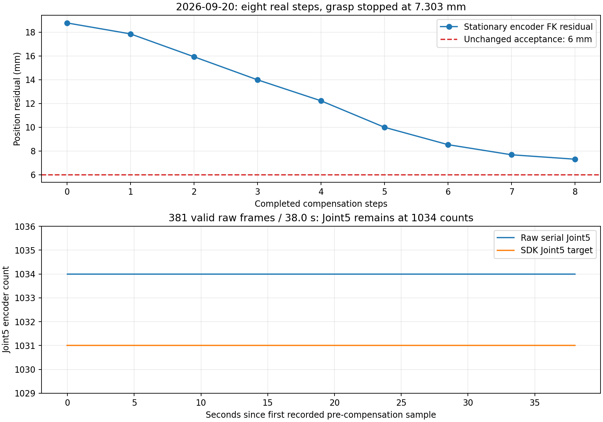

# 2026.9.20 预抓取补偿后的腕部振荡与第五关节保持策略

**最新实机结论：保持J2/J5后，实际8步补偿把FK残差18.784804→7.303033 mm（下降61.12%）；381帧/约38 s原始回包中J5始终1034 count，未复现此前振荡。仍超过6 mm，未闭爪或提起，完整抓取尚未成功。** 本页下方保留历次失败及证据边界。

用户现场确认：“当机械臂到位后进行补偿时，机械臂夹爪关节那部分一直在来回摆动。”本次SDK、原始串口回包及accepted反馈支持第五关节在固定目标下振荡。**本轮抓取失败，未接近、闭爪或提起；不能认定硬件损坏。**

## 实际执行与证据

- 实际版本 `6cce389183f2a0a56fd1c44e401f488c605ebf2f`；task/gateway仍使用`ae4b5c8`的补偿代码，remote已重载过期请求修复。
- 目录 `.ros_log/grasp_expiry_recovery_20260920_011633/`。远场计划 `45f87b3c7a677928161db3a5` 通过，复用当前观察位；近场计划 `4906c7a196d7b702f52bfaa2` 通过，执行104.244 s预抓取轨迹。
- 预抓取实测稳定后，原视觉目标位置误差 **18.120761 mm**、姿态误差约2.693°。随后实际执行一条3 s补偿轨迹，控制器返回成功。
- 该步SDK增量 `[-4,0,+4,-4,+4,-4]`，最终SDK `[753,1533,3098,1790,1122,1034]`。控制器完成后约5.1 s记录中，47条SDK发送目标完全相同；52条accepted、53条有效原始关节回包均显示J5在 **1114～1129 count** 间变化，峰峰15 count约 **1.318°**。
- 同期J3从3083继续变至3087，说明“控制器成功”也不等于所有轴实际停稳。不能单纯延长等待时间或取平均值，就宣称本步实际响应满足约束。
- 网关等待2 s未得到原有0.3 s/最多1 count的停稳窗口，终止 `ENDPOINT_CORRECTION_FEEDBACK_UNAVAILABLE: accepted feedback is not stationary`。本窗口动态FK残差范围 **13.944～16.307 mm**，不是稳定到位值，更不是外部绝对位置测量。
- 用户随后切换手动并换姿态。之后只读12 s采样：手动=true，新SDK `[840,2363,1937,2051,1855,2051]`，108条原始及accepted序列一致且稳定。该不同姿态的稳定性不能用于证明原预抓取姿态振荡已消失；没有自动接管、回退或追加校正。

[完整结果](evidence/2026-09-20/pregrasp_wrist_oscillation_result.json)、[本机文件校验清单](evidence/2026-09-20/pregrasp_wrist_oscillation_manifest.json)。图像和bag保留本机；图中只绘制关节计数。原始帧与accepted的宿主时间不是MCU同步采样时钟，不能据此推断设备内部控制周期。

旧失败日志另有报告问题：实机已执行一步，但取不到新停稳样本时复制了旧报告，仍显示`steps_completed=0`和补偿前18.120761 mm。结果JSON保留原日志，并以action goal/result注明实际一步；下面的软件修复也纠正这一报告问题。

## 软件修改

1. 自动预抓取补偿从起始就保持 **Joint2与Joint5的原SDK目标**，仅搜索Joint1/3/4/6的小步；没有把J5目标回写成编码器值。该策略减少补偿过程中再次激发J5振荡的机会，不是固件稳定化控制器，也不保证保持目标时的负载耦合不会引起运动。
2. 完整路径和控制器接续段必须保持未命令轴在原SDK量化格内。反馈仍必须停稳，保持轴仍参与额外运动检查；没有过滤或平均掉J5摆动。
3. 保留6 mm/5°、每步4 count、每轴总32 count、12步/60 s、0.035 rad及全部几何检查。搜索的预测改进也必须达到原实测进展门的1 μm，避免发出只产生数值级收益、下一步必定被实测进展门拒绝的命令。
4. 动作完成但取不到新停稳样本时，报告已完成动作步数、该动作的目标计数和`post_command_feedback_valid=false`；目标字段不冒充已验证的串口发送或实际到位。旧测量只放入`last_validated_evidence`，不再当成最终位置。

没有修改驱动控制增益、固件、零点或反馈过滤。当前静态SDK目标下的实际振荡还需要结合下位机控制与机构情况进一步定位，主机写成功不是设备目标确认。

## 离线验证与边界

- 新fixture `tests/fixtures/pregrasp_following_20260920_wrist.json`保留本轮真实初始计数、原目标、运行URDF和绑定近场计划。
- **577项受影响回归通过 / 7条既有弃用警告，29.36 s**；包括补偿、网关、任务序列、端点响应、停止包络和路径验证。保持轴额外运动、重复失败额度、无法停稳时的正确报告均有回归。
- 在“其余被命令轴按增量响应”的明确假设下，本轮目标6步至 **5.883482 mm**；“J3每4 count只响应3 count”假设下8步至 **5.693998 mm**。两组共14条合成3 s路径通过条件检查。全部轴无响应仍第一步停止。[假设回放](evidence/2026-09-20/pregrasp_wrist_held_replay.json)。
- 更早9.19目标在保持两轴后，假设响应也仅降到约 **6.510 mm**，第8步后无合格改进而停止。不能宣称四轴策略对所有姿态都可达到6 mm，也未为通过这个反例扩大32 count预算。

**保持J5的新策略已加载，但下一轮未到达补偿阶段。** 用户再次明确关闭直控并授权加载验证；重核控制权后加载gateway PID196624（`e0c9d97`），task PID173083、remote PID184698、driver PID7197保持。重载前后参数及实测关节位置一致。原失败plan/epoch额度没有重置，新任务使用全新视觉计划。

## 加载保持策略后的第一次完整任务：补拍搜索耗尽可执行窗口

目录 `.ros_log/grasp_wrist_held_20260920_014002/`，新远场计划 `4360a1480eeac036729aa891`。真实观察轨迹16.459 s完成。近场需补拍时，第一条完整检查通过的路径已于1789893952.998 s就绪，时长10.354 s；程序继续比较候选，到1789893986.237 s共检查8/48条、合格2条。早先获胜路径的缓存已被后续规划替换，再规划/重验于1789893991.603 s完成，此时原90 s近场期限已不足以覆盖运动、0.9 s停稳和20 s新推理预留。

任务以 `NEAR_FIELD_DIRECT_TIMEOUT` 结束。第一条合格路径到最终拒绝相隔约38.6 s；候选之间才检查的8 s比较/25 s搜索预算不能抢占一次很慢的规划或路径证明。**没有执行补拍、接触预抓取、补偿、闭爪或提起。不能将这次结果称为保持腕部策略的实机收敛验证。** [结果](evidence/2026-09-20/pregrasp_wrist_held_first_attempt_result.json)、[本机证据校验](evidence/2026-09-20/pregrasp_wrist_held_first_attempt_manifest.json)。

修复允许比较预算为0，并将运行配置改为0：找到第一条完整通过检查、且容得下原期限内运动/停稳/推理预留的路径后停止比较，保留其执行缓存。太长的路径不占用“可执行候选”位置，可继续在原25 s候选间预算内寻找更短路径。慢的首次证明本身仍可能耗尽期限，执行前原时效门继续拒绝。没有延长90 s、跳过路径证明或增加补拍次数。新增真实时钟耗时模型回归覆盖第一合格及时执行、第一条太长继续找、证明耗尽期限禁止运动，以及无效预算。任务序列/选择/默认配置共247项通过，7条既有弃用警告。

## 第二次完整任务：保持腕部有效，八步后仍差1.303 mm

- 部署代码 `ed787d2b133ce16264f2c2f64e364bf50a73d78a`，task重载为PID203332；gateway196624、remote184698、driver7197保持。只将补拍比较预算8→0，重载前后实测关节位置一致。用户直控关闭，使用全新视觉计划，未重置上一轮计划额度。
- 目录 `.ros_log/grasp_first_qualified_20260920_015411/`；远场 `8cf3704e203e667f0518d130`，近场 `445fb9ab339b5e839f433157`。观察轨迹3.499 s完成，本轮不需要补拍，随后接触预抓取轨迹91.938 s完成。因此本轮不能用于宣称新的补拍早停分支已实机执行到。
- 初始SDK `[895,1490,3195,2210,1031,2970]`，初始实测 `[893,1473,3177,2206,1034,2964]`。8条3 s补偿轨迹均实际执行；每步之后取得新停稳样本，位置残差逐步下降。

| 完成补偿步数 | 原视觉目标的编码器FK位置残差（mm） |
|---|---:|
| 0 | 18.784804 |
| 1 | 17.860021 |
| 2 | 15.934335 |
| 3 | 13.991498 |
| 4 | 12.223325 |
| 5 | 9.990232 |
| 6 | 8.527957 |
| 7 | 7.675141 |
| 8 | 7.303033 |

补偿起点前约1 s至最终失败后约3 s的38.0 s窗口内，381条有效原始串口关节回包与381条accepted计数序列逐条一致；**J5全部为1034、J6全部为2964 count**。365条SDK中J5目标保持1031。原始反馈并没有被平滑后才看似稳定；这也只支持本姿态、本窗口未复现振荡，不证明所有姿态稳定或固件根因已修复。

第1步J6命令−4、反馈0，被保持；第4步J1命令+2、反馈0，被保持。第5步未再命令J1但反馈+2，说明存在迟到/耦合变化，不能把第4步直接解释为硬件永久失效。该+2仍在既有未命令轴响应范围内。J2在整个补偿过程中1490目标不变，实测1473→1471。最终SDK `[903,1490,3227,2236,1031,2966]`，实测 `[901,1471,3208,2233,1034,2964]`，姿态误差约2.057°。

第三关节目标累计+32达到原总额度；第一/二/五/六关节保持，当前离散搜索没有下一条有界有效改善。任务 `PREGRASP_NO_BOUNDED_IMPROVING_STEP` 失败并释放执行槽，未接近、闭爪、提起或自动回退，推理已停止；夹爪反馈全程0.04975 m。没有扩大6 mm、32 count、单步4 count、跟随差或停稳门。

[完整阶段结果](evidence/2026-09-20/pregrasp_wrist_held_actual_result.json)、[逐步响应及原始计数分析](evidence/2026-09-20/pregrasp_wrist_held_actual_analysis.json)、[本机文件校验](evidence/2026-09-20/pregrasp_wrist_held_actual_manifest.json)。本机211 MiB原始bag与RGB-D图像没有公开上传。

### 离线核验与后续边界

新增 `pregrasp_following_20260920_held_actual.json` 固化真实目标、URDF、近场绑定计划和9个实测样本；回归按真实响应（包括J1迟到及J2漂移）重放八步，保持相同目标序列、32 count额度、7.303 mm失败，重复调用仍不能续跑。补偿测试34项通过，3.29 s。此前补拍修复247项回归通过；没有把分次测试声称为一次全套验证。

离线把仍活动的J3/J4允许范围内4225个整数终点全部计算，在假设两轴后续单位响应、其余实测不漂移且只看终点的宽松条件下，3420个符合姿态界，最小位置误差仍约7.237 mm；该终点也不是新的合格路径或命令许可。原始四轴从起点的理想连续响应启发式搜索可找到约5.526 mm终点，但依赖本轮没有证实的J1/J6响应，不是实机收敛证据或全局最优证明。

下一步需针对非重复的小步响应和J2负载下漂移改善可预测性，或在视觉候选阶段选出原有补偿预算内实际可达的构型；不能靠重置这轮额度或放宽误差线获取成功。本次结果并未确定硬件损坏。
