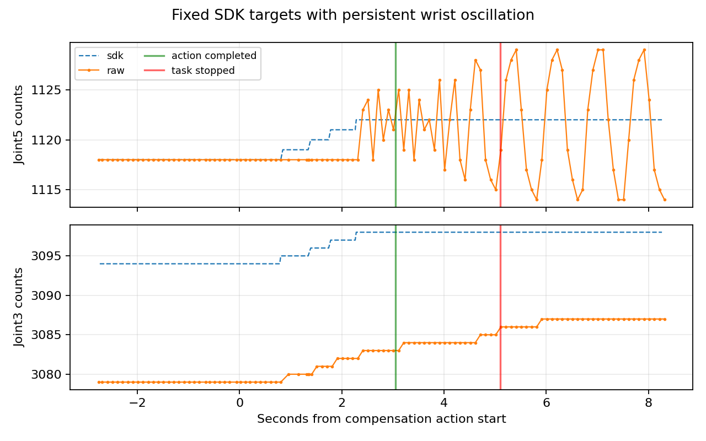

# 2026.9.20 预抓取补偿后的腕部振荡与第五关节保持策略

用户现场确认：“当机械臂到位后进行补偿时，机械臂夹爪关节那部分一直在来回摆动。”本次SDK、原始串口回包及accepted反馈支持第五关节在固定目标下振荡。**本轮抓取失败，未接近、闭爪或提起；不能认定硬件损坏。**

## 实际执行与证据

- 实际版本 `6cce389183f2a0a56fd1c44e401f488c605ebf2f`；task/gateway仍使用`ae4b5c8`的补偿代码，remote已重载过期请求修复。
- 目录 `.ros_log/grasp_expiry_recovery_20260920_011633/`。远场计划 `45f87b3c7a677928161db3a5` 通过，复用当前观察位；近场计划 `4906c7a196d7b702f52bfaa2` 通过，执行104.244 s预抓取轨迹。
- 预抓取实测稳定后，原视觉目标位置误差 **18.120761 mm**、姿态误差约2.693°。随后实际执行一条3 s补偿轨迹，控制器返回成功。
- 该步SDK增量 `[-4,0,+4,-4,+4,-4]`，最终SDK `[753,1533,3098,1790,1122,1034]`。控制器完成后约5.1 s记录中，47条SDK发送目标完全相同；52条accepted、53条有效原始关节回包均显示J5在 **1114～1129 count** 间变化，峰峰15 count约 **1.318°**。
- 同期J3从3083继续变至3087，说明“控制器成功”也不等于所有轴实际停稳。不能单纯延长等待时间或取平均值，就宣称本步实际响应满足约束。
- 网关等待2 s未得到原有0.3 s/最多1 count的停稳窗口，终止 `ENDPOINT_CORRECTION_FEEDBACK_UNAVAILABLE: accepted feedback is not stationary`。本窗口动态FK残差范围 **13.944～16.307 mm**，不是稳定到位值，更不是外部绝对位置测量。
- 用户随后切换手动并换姿态。之后只读12 s采样：手动=true，新SDK `[840,2363,1937,2051,1855,2051]`，108条原始及accepted序列一致且稳定。该不同姿态的稳定性不能用于证明原预抓取姿态振荡已消失；没有自动接管、回退或追加校正。

[完整结果](evidence/2026-09-20/pregrasp_wrist_oscillation_result.json)、[本机文件校验清单](evidence/2026-09-20/pregrasp_wrist_oscillation_manifest.json)。图像和bag保留本机；图中只绘制关节计数。原始帧与accepted的宿主时间不是MCU同步采样时钟，不能据此推断设备内部控制周期。

旧失败日志另有报告问题：实机已执行一步，但取不到新停稳样本时复制了旧报告，仍显示`steps_completed=0`和补偿前18.120761 mm。结果JSON保留原日志，并以action goal/result注明实际一步；下面的软件修复也纠正这一报告问题。

## 软件修改

1. 自动预抓取补偿从起始就保持 **Joint2与Joint5的原SDK目标**，仅搜索Joint1/3/4/6的小步；没有把J5目标回写成编码器值。该策略减少补偿过程中再次激发J5振荡的机会，不是固件稳定化控制器，也不保证保持目标时的负载耦合不会引起运动。
2. 完整路径和控制器接续段必须保持未命令轴在原SDK量化格内。反馈仍必须停稳，保持轴仍参与额外运动检查；没有过滤或平均掉J5摆动。
3. 保留6 mm/5°、每步4 count、每轴总32 count、12步/60 s、0.035 rad及全部几何检查。搜索的预测改进也必须达到原实测进展门的1 μm，避免发出只产生数值级收益、下一步必定被实测进展门拒绝的命令。
4. 动作完成但取不到新停稳样本时，报告已完成动作步数、该动作的目标计数和`post_command_feedback_valid=false`；目标字段不冒充已验证的串口发送或实际到位。旧测量只放入`last_validated_evidence`，不再当成最终位置。

没有修改驱动控制增益、固件、零点或反馈过滤。当前静态SDK目标下的实际振荡还需要结合下位机控制与机构情况进一步定位，主机写成功不是设备目标确认。

## 离线验证与边界

- 新fixture `tests/fixtures/pregrasp_following_20260920_wrist.json`保留本轮真实初始计数、原目标、运行URDF和绑定近场计划。
- **577项受影响回归通过 / 7条既有弃用警告，29.36 s**；包括补偿、网关、任务序列、端点响应、停止包络和路径验证。保持轴额外运动、重复失败额度、无法停稳时的正确报告均有回归。
- 在“其余被命令轴按增量响应”的明确假设下，本轮目标6步至 **5.883482 mm**；“J3每4 count只响应3 count”假设下8步至 **5.693998 mm**。两组共14条合成3 s路径通过条件检查。全部轴无响应仍第一步停止。[假设回放](evidence/2026-09-20/pregrasp_wrist_held_replay.json)。
- 更早9.19目标在保持两轴后，假设响应也仅降到约 **6.510 mm**，第8步后无合格改进而停止。不能宣称四轴策略对所有姿态都可达到6 mm，也未为通过这个反例扩大32 count预算。

**保持J5的新策略尚未实机验证。** 最后检测到`/gui/joint_direct_mode=true`，因此未替换正在手动使用的网关或启动自动任务。再次执行需操作者结束手动并交回控制；来源是网关现有`_manual_control_active()`控制权检查。原失败plan/epoch额度保持已消费，下一次必须用新的完整视觉计划。
