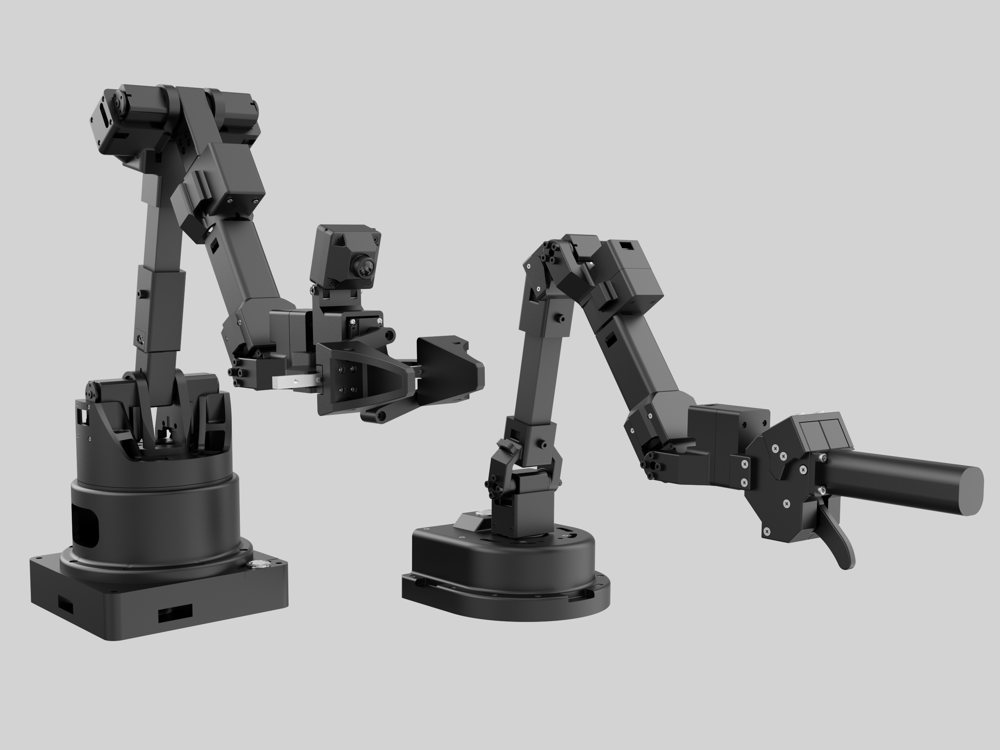

# Alicia-D SDK  


[English Version](README_EN.md) | [中文版](README.md) | [官方淘宝店](https://g84gtpygdv6trpvdhcsy0kfr73avcip.taobao.com/shop/view_shop.htm?appUid=RAzN8HWKU5B7MfX6JjEWgkuNfftNVbnrjbjx6fPjY9KqXB46Rvy&spm=a21n57.1.hoverItem.2) | [Alicia-D 产品手册（中文）](https://docs.sparklingrobo.com/)

<p align="center"></p>


**Alicia-D SDK** 是一个用于控制【灵动 Alicia-D】系列六轴机械臂（带夹爪）的 Python 工具包。它基于 `RoboCore` 库构建，提供通过串口通信控制机械臂运动、操作夹爪、读取姿态与状态数据等功能。


## RoboCore: Unified High-Throughput Robotics Library 


本SDK由[Synria Robotics Co., Ltd.](https://synriarobotics.ai) 开发的 [RoboCore (Unified High-Throughput Robotics Library)](https://github.com/Synria-Robotics/RoboCore) 支持。


[](LICENSE)
[](https://www.python.org/)


---

### ✨ 核心功能

| 模块 | 功能 | 状态 |
|---|---|---|
| **建模** | URDF/MJCF 解析, 机器人模型抽象 | ✅ Stable |
| **正向运动学** | 支持 C++/NumPy/PyTorch 后端, 批处理 | ✅ Stable |
| **逆向运动学** | 支持 DLS/Pinv/Transpose 多种求解器, 多起点求解 | ✅ Stable |
| **雅可比矩阵** | 支持解析法/数值法/自动微分法 | ✅ Stable |
| **坐标变换** | SE(3)/SO(3) 刚体变换, 多种格式转换 | ✅ Stable |
| **运动学分析** | 工作空间/奇异点分析 | ✅ Beta |
| **轨迹规划** | 轨迹生成 | ✅ Beta |
| **可视化** | 运动学链可视化 | ✅ Stable |
| **配置管理** | 基于 YAML 的配置管理 | ✅ Stable |


## 主要特性

*   **关节控制**：支持设置与读取六个关节的角度，提供平滑插值执行。
*   **末端轨迹**：基于 Cartesian 末端姿态轨迹规划与执行。
*   **夹爪控制**：支持精确角度控制或一键开关。
*   **力矩控制**：开启或关闭关节电机扭矩，实现自由拖动（示教）。
*   **零点设置**：将当前位置设置为新的零点。
*   **状态读取**：实时获取关节角、夹爪角与末端姿态。
*   **自动串口连接**：自动搜索串口或手动指定。
*   **拖动示教**：拖动记录姿态点并执行轨迹。
*   **日志系统**：支持日志级别过滤，可控制控制台输出详细程度。
*   **RoboCore 集成**：默认使用 RoboCore cpp backend，并保留 `numpy` / `torch` 显式切换能力。

## 项目结构

```
├── alicia_d_sdk
│   ├── api
│   │   └── synria_robot_api.py      # 用户层API
│   ├── execution
│   │   └── hardware_executor.py     # 执行层
│   ├── hardware
│   │   ├── serial_comm.py           # 串口通信
│   │   ├── data_parser.py           # 数据解析
│   │   └── servo_driver.py          # 舵机数据发送
│   ├── __init__.py
│   └── utils
│       ├── calculate.py             # 控制计算函数
│       └── logger/                  # 日志系统
├── docs
│   ├── api_reference.md             # API参考
│   ├── examples.md                  # 例程说明
│   ├── installation.md              # 安装指南
│   └── logger_levels.md             # 日志级别
├── examples
│   ├── 00_demo_read_version.py      # 读取固件版本
│   ├── 01_torque_switch.py          # 扭矩开关
│   ├── 02_demo_set_new_zero.py      # 设置新零点
│   ├── 03_demo_read_state.py        # 读取状态
│   ├── 04_demo_move_gripper.py      # 夹爪控制
│   ├── 05_demo_move_joint.py        # 关节运动
│   ├── 06_demo_forward_kinematics.py  # 正向运动学
│   ├── 07_demo_inverse_kinematics.py  # 逆向运动学
│   ├── 08_demo_drag_teaching.py     # 拖动示教
│   ├── 09_demo_joint_traj.py        # 关节空间轨迹规划
│   ├── 10_demo_cartesian_traj.py    # 笛卡尔空间轨迹规划
│   ├── 11_benchmark_read_joints.py  # 关节读取性能测试
│   └── 12_utmostFPS.py              # 最大帧率测试
```

## 安装

```bash
pip install alicia_d_sdk
```

## 快速开始

1.  安装：使用 `pip install alicia_d_sdk` 或参见 [安装指南](docs/installation.md)
2.  运行示例：
```bash
cd examples
python3 00_demo_read_version.py    # 读取固件版本
python3 03_demo_read_state.py      # 读取状态
python3 04_demo_move_gripper.py    # 夹爪控制
python3 05_demo_move_joint.py      # 关节移动
```

## 文档

**中文文档：**
*   [安装指南](docs/installation.md)
*   [示例说明](docs/examples.md)
*   [API 参考](docs/api_reference.md)
*   [日志级别](docs/logger_levels.md)

**English Documentation:**
*   [Installation Guide](docs/installation_en.md)
*   [Examples Guide](docs/examples_en.md)
*   [API Reference](docs/api_reference_en.md)
*   [Logger Levels](docs/logger_levels_en.md)
